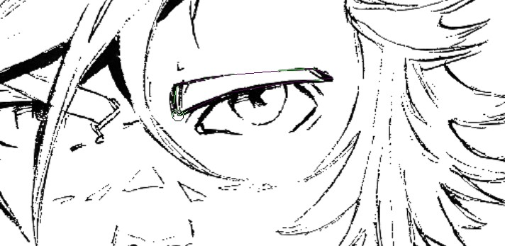
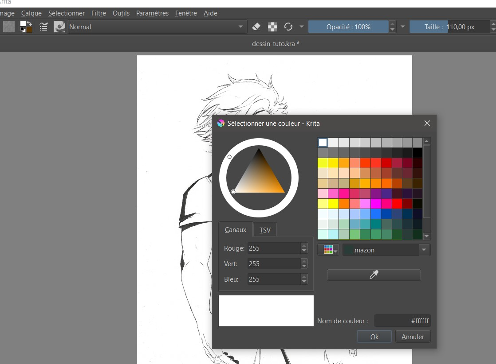
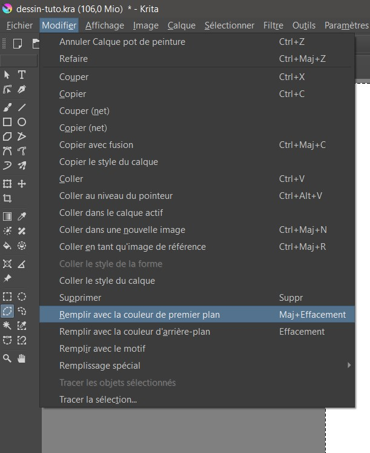
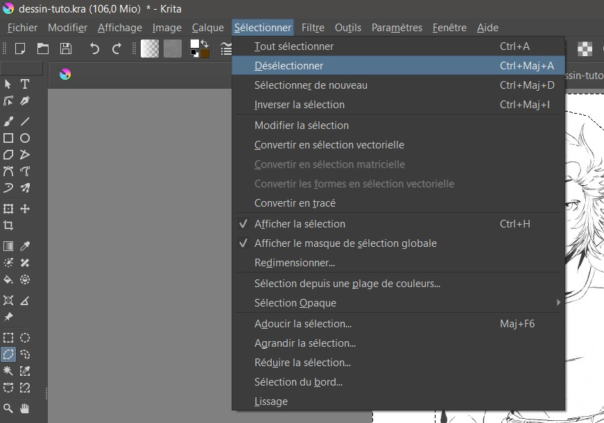

### Index 
- [Prérequis](#prérequis)
- [Scanner son dessin](#scanner-son-dessin)
- [Présentation de Krita](#présentation-de-krita)
- [Création d'un nouveau fichier et importation du scan](#création-du-nouveau-fichier-et-importation-du-scan)
- [Mise au propre des lignes](#mise-au-propre-des-lignes)
- [Isoler les lignes sur un nouveau calque](#isoler-les-lignes-sur-un-nouveau-calque)
- [Colorisation, plusieurs techniques](#colorisation-plusieurs-techniques)

Alors ça y est, vous venez de finir l'encrage d'un dessin sur feuille, et vous voudriez passez à la colorisation en numérique. Dans ce tutoriel, nous verrons comment scanner, ouvrir son dessin dans un nouveau fichier Krita, et passer à la colorisation sans se mordre les doigts ! 

## Prérequis

- Votre joli dessin
- Un scanner
- Un PC
- Krita 
- Tablette graphique (recommandé) ou souris (un peu plus ardu, mais faisable !)

## Scanner son dessin

On va commencer par le plus important :  un scan propre de votre dessin. 

Voilà nos critères : 

1. **Propreté** : Assurez vous que votre dessin soit le plus propre possible. Effacez bien votre crayonné s'il le faut. Enlevez les résidus de gomme. Vous pouvez même passer un petit coup de microfibre propre et sèche sur la vitre du scanner.  

2. **Définition** : Pour les options du scan, voilà les options que je vous recommande : 
- Type de fichier : PNG 
- Résolution (ppp) : 300 (minimum) ou 600 (optimal)

- *PPP, qu'est-ce que c'est ? (l'acronyme de Petit Poulpe Perdu ?)* PPP est une unité de mesure pour définir la résolution d'une image, il signifie le nombre de Pixels Par Pouce. Plus ce chiffre est élevé, plus la qualité est élevée, et... plus le fichier est lourd ! on le retrouve aussi sous le nom de ppi dans certains logiciels, ppi est Pixels Per Inch, sa version anglophone 

- *Qu'est-ce qui définit la définition ?*
Personnellement, je m'assure de toujours **scanner à une définition plus élevée que le dessin final**, pour éviter de me retrouver à travailler sur un fichier zoomé et pixelisé.**Mieux vaut réduire la taille d'un scan de qualité, plutôt que d'augmenter la taille un scan de qualité médiocre**. Ici, on vise au minimum la haute définition, ce qui va nous donner une image au minimum de 1280 pixels par 720 pixels. 

## Présentation de Krita

Krita est un logiciel de graphisme très prisé par les dessinateurs pour trois raisons principales. D'une, il est très complet et intuitif, de deux, il est fait pour les illustrateurs plus que pour les graphistes, donc plus facile à prendre en main pour nous, scribouillard-es, et de trois, il est gratuit ! (c'est, comme Gimp, un logiciel dit open-source)

[Vous pouvez le télécharger en visitant leur site officiel](https://krita.org/fr/download/) ( https://krita.org/fr/download/ ) 

- Note : Les outils que nous allons utiliser dans la suite du tutoriel sont des outils que l'on peut aussi retrouver sur [Gimp](https://www.gimp.org/), mais ils n'ont parfois pas le même nom ni le même emplacement. Ici il s'agit surtout de vous montrer des techniques pour faciliter la colorisation d'un dessin traditionnel à partir d'un logiciel de traitement d'image. 

## Création du nouveau fichier et importation du scan

### Technique 1 : Ouvrir directement le fichier dans krita puis le sauvegarder en tant que fichier Krita (.kra)

C'est la techique la plus simple et rapide, mais aussi celle qui vous donnera moins de libertés sur le choix de résolution et dimension de l'image. Ici les dimensions seront celles qui auront été héritées de celles du fichier de base, vous pourrez toujours les modifier par la suite mais cela sera plus dur que d'utiliser la technique 2 directement et préciser les dimensions que l'on veut vraiment. 

Ouvrir Krita Aller sur Fichier > Ouvrir (raccourci : Ctrl + O)
Sélectionner le dessin que nous avons scanné, l'ouvrir. 

- Il va s'ouvrir en tant qu'Arrière plan, dans les calques (à droite sur la fenêtre). 
- Double-cliquer sur son nom et le renommer 'scan' ou 'numérisation' 
- Créer un nouveau calque et le placer en dessous du scan
- Double-cliquer sur son nom et le renommer 'fond' ou 'Arrière-plan'
- Se positionner sur le calque de fond

- Sélectionner le pot de peinture (raccourci : F), la couleur blanche, et cliquez pour peindre tout le calque en blanc
- Sauvegarder le fichier : Fichier > Enregistrer Sous... (raccourci Ctrl + Maj + S)
- Sélectionner l'emplacement
- Dans le menu déroulant des formats, sélectionner le format Krita (.kra)
Valider

### Technique 2 : Créer un nouveau fichier Krita (.kra) et importer le scan en tant que calque du fichier 

C'est une technique plus longue à prendre en main pour les débutants, mais c'est une technique plus 'propre'.

Ouvrir Krita, puis aller dans Fichier > Nouveau (raccourci = Ctrl + N)

Nous avons maintenant une nouvelle fenêtre proposant de nombreuses options. Avis aux débutants : pas de panique, beaucoup de ces options sont prédéfinies pour nous et vous n'aurez pas à les modifier pour le moment. Il vous suffit de : 

1. Dans Dimensions, Taille de l'image, dans la section Prédefinie : cliquer le menu déroulant
2. Sélectionner A4 (300ppi si vous avez scanné avec 300ppi, ou 6000)
3. Dans la section hauteur, définir au minimum 2480 Pixels 
4. Dans la section largeur, définir au minimum 3508 Pixels
5. Si vous travaillez sur un format paysage, inversez les deux valeurs ou cliquez sur l'icône à côté du menu déroulant 'Prédefinie' qui correspond à votre orientation d'image

Note : Personnellement, quand je réalise des dessins amateurs et des commandes, scannant mes dessins à une résolution de 600ppi, je favorise A4 (600 ppi), avec un format de 4961px par 7016px. Mais cela crée des fichiers lourds en termes de stockage et aussi d'utilisation de la mémoire. Avec un PC à 16Go de RAM ou plus, pas de problème, mais je vous recommande de baisser la résolution/qualité dans le cas où votre PC aurait moins de capacités, sinon vous rencontrerez la frustration de tirer un trait à la tablette ou à la souris, et de ne le voir apparaître qu'après quelques secondes. 

Vous pouvez valider après ceci. 

Maintenant que vous avez un nouveau fichier, sauvegardez-le une première fois : Fichier > Enregistrer (raccourci : Ctrl + S), choisissez l'emplacement et nommez-le. 

Ensuite, importez le dessin que vous venez de scanner dans ce fichier : ouvrir avec l'explorateur de fichier l'emplacement où vous l'avez enregistré lors de sa numérisation, et faites un glissé-déposé au dessus du fichier Krita que vous venez de créer. 
Krita va vous demander de quelle manière vous souhaitez importer ce fichier, et vous devrez séletionner "Insérer en tant que nouveau calque."

Vous pouvez aussi ouvrir votre scan dans Krita en utilisant : Fichier > Ouvrir (raccourci : Ctrl + O) et ensuite copier (raccourci : Ctrl + C), puis coller le scan sur votre fichier Krita (raccourci : Ctrl + V), à partir de là, vous aurez le même choix que pour la technique du glissé-déposé évoquée plus tôt. Sélectionnez "Insérer en tant que nouveau calque."

**Si votre Arrière-plan est transparent :**
- Sélectionnez le pot de peinture (raccourci : F)
- Sélectionnez la couleur Blanc
- Assurez-vous que vous êtes bien sur le calque "Arrière-plan"
- Cliquez pour peindre le calque en blanc

**Si votre image importée est plus grande que la surface de travail du fichier que vous venez de créer**
- Assurez-vous d'être sur le calque du scan importé
- Sélectionnez l'outil 'Transformer un calque ou une Sélection' (raccourci : Ctrl + T)
- Tout en maintenant la touche Maj enfoncée, adaptez la taille du scan à votre fichier

Sauvegardez votre nouveau fichier. 

## Mise au propre des lignes

Maintenant que notre fichier est paré, on va pouvoir mettre au propre les lignes. Ce ique l'on veut, ici, c'est avoir une nette démarquation entre les traits et le fond de la feuille, et faire disparaître au mieux les nuances de gris. 
- Aller sur le calque du scan
- Aller dans Filtre > Ajuster > Densité +...
- Dans le menu, sélectionner Ombres : vous allez voir un curseur prédéfini à 50

- Régler le curseur pour assombrir les gris, j'ai pour l'habitude de le régler au maximum, ce qui supprime toute demi-teinte non voulue.

Note, dans Filtre > Ajuster, il y a d'autres moyens d'ajuster les teintes pour passer les gris en noir, mais la technique ci-dessus est la plus rapide que j'aie pu trouver dans ce menu. 

## Isoler les lignes sur un nouveau calque

Maintenant que nous avons un encrage bien délimité, il faut à présent le détacher du fond blanc. On pourrait gommer les zones en blanc et ne laisser que les zones en noir pour isoler ces lignes, ou sélectionner ces zones à la main (ou plutôt la souris) et supprimer leur contenu une à une, mais il existe une technique bien moins chronophage. Il est possible de sélectionner une couleur sur un calque et de tout simplement la supprimer dans son entièreté en un seul clic ! Pour faire ceci, suivre ces étapes : 

- s'assurer que l'on est bien sur le calque du scan que nous avons importé
- Sélectionner l'outil Sélection par la couleur 

- Cliquez sur la partie noire de votre dessin
- Ceci étant fait, vous devriez avoir les contours de vos lignes en pointillés

- Appuyez sur 'Suppr' pour supprimer le contenu de votre sélection

- Maintenant, si vous masquez le calque de fond (qui est en blanc), vous devriez voir que toutes les zones en blanc ont disparu de votre scan. 
- Pour déselectionner, Allez dans Sélectionner > Désélectionner (raccourci : Ctrl + Maj + A)
- Sauvegarder votre travail : Ctrl + S

Bravo, que vous ayez une tablette graphique ou non, vous avez pu avec succès séparer l'encrage sur un autre calque que le fond ! Vous allez tout de suite comprendre le grand avantage que cette technique apporte.

## Colorisation, plusieurs techniques

Maintenant, créez un nouveau calque, que vous appelerez 'couleur', 'colorisation'... etc et placez-le entre l'encrage et le fond. Vous pouvez constater que si vous tirez un trait bleu au pinceau (raccourci : B) sur ce calque, l'encrage reste tel quel. Maintenant, vous pouvez colorer votre dessin comme bon vous semble, sont plus avantagés ici les dessinateurs avec des tablettes graphiques, alors je vais vous laisser avec quelques conseils pour coloriser efficacement en utilisant des outils de sélection, cela est très pratique notamment quand vous avez une assez grande surface à colorer. 

## L'outil de Sélection, votre nouveau meilleur ami (surtout pour les dessinateurs sans tablette graphique)

- Sélectionnez une zone à coloriser 
- Cliquez sur l'outil Sélection à main levée, tracer le contour de la zone **ou** Cliquez sur l'outil Sélection polygonale et tracer le contour de la zone, fermez la boucle en revenant sur votre premier clic (qui sera entouré d'un petit cercle quand vous rapprocherez le curseur de celui-ci)

 

- Sélectionnez la couleur que vous voulez appliquer avec le sélecteur

- Si vous devez retirer une partie de la zone sélectionnée, entourer cette partie avec votre outil de sélection. Par défaut, il supprime la sélection en trop

- Si vous devez rajouter une zone à la sélection, gardez maj enfoncée et sélectionnez cette zone.

- Aller dans Modifier > Remplir avec la couleur de premier plan ou d'arrière plan (racourci : Maj + Effacement -ou- Ctrl + Maj + Effacement)

- Pour déselectionner, allez dans dans Sélectionner > Désélectionner (raccourci : Ctrl + Maj + A)

En vous habituant à cette petite technique, vous allez vous familiariser avec des raccourcis, voilà un récapitulatif des raccourcis les plus utiles pour votre future colorisation : 

- Ctrl + Effacement : Remplir la zone sélectionnée avec la couleur de premier plan 
- Effacement : Remplir la zone sélectionnée avec la couleur d'arrière plan 
- Ctrl + Z : Annuler l'action 
- Suppr : Effacer le contenu de la sélection 
- Ctrl + Maj + A : Tout déselectionner 
- Avec l'outil de sélection : Maj enfoncée pour rajouter une zone de sélection

