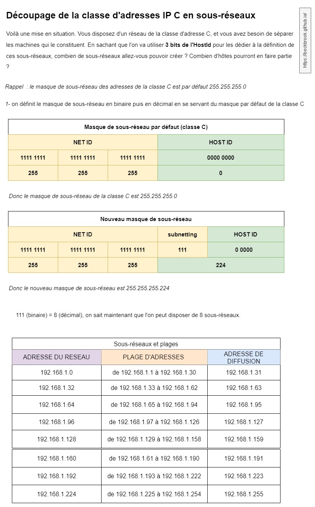

### Index 

- [Rappels](#rappels)
- [Les différentes classes de réseaux](#les-différentes-classes-de-réseaux)
- [La classe A](#la-classe-a)
- [La classe B](#la-classe-b)
- [La classe C](#la-classe-c)
- [La classe D](#la-classe-d)
- [La classe E](#la-classe-e)
- [Les sous-réseaux](#les-sous-réseaux)
- [Découpage en sous-réseaux](#découpage-en-sous-réseaux)

Les adresses IP (Internet Protocol) sont au coeur du thème sur le réseau. Afin d'améliorer les communications auprès de ce dernier, il a été décidé de les regrouper en différentes catégories avec différents besoins. On les appelle : 'classes d'adresses IP'.
Toutes ces classes d'adresses IP ont le même nombre d'hôtes possible. Dans cet article nous verrons les noms et fonctions de ces groupes. 

# Rappels

- *De quoi est composée une adresse IP ?*

Une adresse IP est généralement divisée en deux parties, son début représente l'identifiant du réseau (netId), et sa fin représente l'identifiant de l'hôte (hostId). 

Vous l'aurez compris, plus un adresse IP présente un hostId long, et plus de machines peuvent se trouver dans un seul et même réseau. 

- *Comment est formée une adresse IPV4 ?*

Une adresse IPV4 est une suite de quatre nombres séparés de points (par exemple 192.168.1.32). Elle permet à différents hôtes de communiquer et d'être identifiés sur le réseau. Ces nombres sont compris de 0 à 255. Ils sont décimaux pour faciliter la lecture d'un point de vue humain, mais pour mieux comprendre pourquoi on s'arrête à 255, il faut les convertir en binaire : On observe que 255(décimal) = 11111111(binaire). Pas un seul 0 en vue. C'est normal, car c'est la valeur maximale que l'on peut atteindre en codant un nombre binaire sur 8 bits, appelé aussi octet.

Il sera important pour la suite de l'article d'avoir bien pris conscience qu'**une adresse IP est codée en binaire, et composée de quatre octets.**

- *Le bit de poids fort ?* 

Dans un nombre binaire, les bits n'ont pas tous le même poids : en convertissant un 1 dans un nombre binaire, il peut définir = 1, 2, 4, 8, 16 ... etc. selon sa position. Le bit de poids fort c'est le bit ayant le plus de valeur dans un nombre binaire. Comme nous l'avons vu dans l'article de conversions, c'est le bit étant le plus à gauche.

article sur les conversions : https://beckbrook.github.io/reseau/hexaBinDeci.html

# Les différentes classes de réseaux

Les classes de réseaux sont rangées en cinq groupes nommmés de la lettre A à la lettre E. 

## La classe A

Le premier octet (ou nombre) de la classe A est entre **1 et 126**. Son 'bit de poids fort' vaut 0. Le premier nombre ou octet de l'adresse définit l'adresse du réseau, et le reste des octets définit l'adresse de l'hôte.  

Donc, avec ces adresses il est possible de rassembler un très grand nombre d'hôtes dans un réseau ! 

### Où retrouve-t-on des adresses IP de la classe A ? 

En pratique, on manipule peu d'adresses IP de la classe A, elles sont réservées à de grands groupes, ou même aux gouvernements car dans un seul réseau défini par la classe A, on peut trouver énormément de machines hôtes !

## La classe B

le premier octet de la classe B est entre **128 et 191**. Les deux bits de poids fort de ce nombre sont 1-0. Les deux premiers octets des adresses de la classe B définissent l'identifiant du réseau et le reste définit l'identifiant de l'hôte. 

### Où retrouve-t-on des adresses IP de la classe B ?

Les adresses de la classe B peuvent être utilisées par des entreprises de taille moyenne ou bien des universités. Il est plus courant de les rencontrer dans le domaine professionnel. 

## La classe C 

Le premier octet de la classe C est entre **192 et 223**. Les 3 bits de poid fort de ce nombre sont 1-1-0. Les trois premiers octets des adresses de la classe C définissent l'identifiant du réseau et le reste définit l'identifiant de l'hôte. 

### Où retrouve-t-on des adresses IP de la classe C ? 

Ce sont les adresses les plus répandues, utilisées par de petits réseaux (petites entreprises ou chez des particuliers), il est possible de rencontrer 254 hôtes sur un même réseau utilisant une adresse de la classe C. 

## La classe D

Le premier octet de la classe D est entre **224 et 239**. Les 4 bits de poids fort de ce nombre sont 1-1-1-0. Tous les octets sont réservés pour l'identifiant de réseau (NetId). 

### Où retrouve-t-on des adresses IP de la classe D ? 
Ces addresse particulières sont utilisées pour des services de multi-diffusion, ou multicast. Ils servent à communiquer à des groupes d'hôtes, ou hosts-groups. 

## La classe E

Le premier octet de la classe E est entre **240 et 255**. Les 4 bits de poids fort de ce nombre valent 1-1-1-1. Les adresses comprises dans la classe E sont des adresses réservées par l'institution IANA, elle ne sont pas utilisées. 

### Où retrouve-t-on des adresses IP de la classe E ? 
Elles sont réservées par l'IANA, ce qui signifie qu'on ne peut en rencontrer nulle part. 

## *Et les adresses commençant par 127 ?* 

Vous avez pu le remarquer, il y a un 'trou' entre les adresses comprises dans la classe A et dans la classe B. Ce n'est pas un hasard. Les adresses commençant par 127 sont dédiées aux communications en 'boucle locale'. Elles sont donc reservées. 

## *Et l'adresse 0.0.0.0 ?*

Elle n'existe tout simplement pas ! 

# Les sous-réseaux

Comme nous venons de le voir, les classes d'adresses A, B et C sont des classes coupées en deux parties, celle qui nous permet d'identifier le réseau (NetID) et celle qui nous permet de définir l'hôte (HostID). En fontion du nombre d'octets attribués à l'une ou l'autre, on peut définir plus ou moins de réseaux et de nombre de machines possibles en fonction de la classe de l'adresse. 

### Pour la classe A : 
- Nombre de réseaux possibles : 127 
- Nombre d'hôtes max. : 16 777 214 
- Masque de sous-réseau par défaut : 255.0.0.0

### Pour la classe B 
- Nombre de réseaux possibles : 16 384
- Nombre d'hôtes max. : 65 534
- Masque de sous-réseau par défaut : 255.255.0.0 

### Pour la classe C
- Nombre de réseaux possibles : 2 097 152
- Nombres d'hôtes max : 254
- Masque de sous-réseau par défaut : 255.255.255.0 

## Découpage en sous-réseau

Savoir découper une classe d'adresses en sous réseaux, ce qui équivaut à diviser la partie des adresses hôtes (hostId) en de nouveaux groupes d'adresses, est une technique très pratique pour solutionner le problème de distribution de l'espace d'adressage. On l'appelle le "subnetting".

Cette technique permet entre autres de cloisonner les domaines de diffusion. Ce cloisonnement est pratique pour de nombreuses raisons. Par exemple, dans une entreprise, on cherchera toujours à séparer les téléphones IP des ordinateurs, car leurs méthodes de communications pourraient interférer entre elles. On va donc créer un réseau pour les ordinateurs, et un autre pour les téléphones. 
Ensuite, il y a un aspect de sécurité derrière le cloisonnement des domaines de diffusion : certains virus, comme le ver Sasser, se servent des diffusions pour identifier des machines sur le réseau. Cela représente donc un avantage non négligeable au niveau de la cybersécurité.

### Procédé

Pour définir des sous-réseaux à partir d'une adresse d'une classe A ou B ou C..., on va d'une certaine manière 'allonger' la partie de la classe qui identifie les réseaux. Ensuite, en fonction du nombre de réseaux que l'on va avoir 'gagné', on pourra fixer le nombre d'hôtes pouvant se trouver sur un seul d'entre eux, tout en retirant à chaque fois de cette plage d'adresses disponibles pour les hôtes : l'adresse du réseau et l'adresse de diffusion. donc c'est un -2 à chaque sous-réseau, pour résumer. 

Si l'on réserve trois bits pour définir les sous-réseaux, alors on disposera de huit sous-réseaux possibles : 111 (binaire) = 8 (décimal). Si l'on en réserve deux, on disposera de trois réseaux : 11 (binaire) = 3 (décimal), etc. 

## Exemple 

Dans cette partie, on verra un cas pratique, avec un tableau de sous-réseaux, qui est important quand on met en place ou réfectionnne des réseaux, afin de garder une trace écrite des adresses et des découpages du réseau :

---
