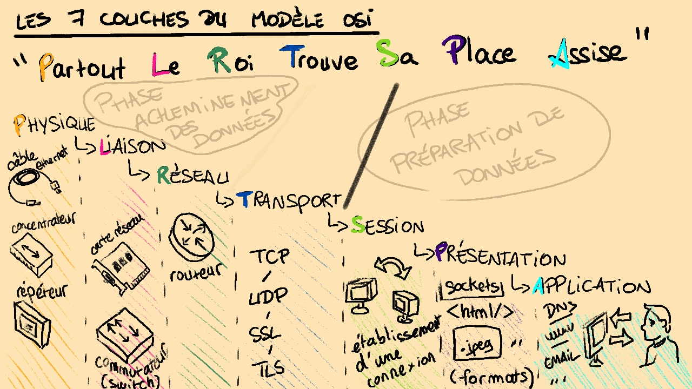

### Index 

- [Rappels](#rappels)
- [Le Modèle OSI](#le-modèle-osi)
- [Les sept couches](#les-sept-couches)
- [Moyens mnémotechniques](#moyens-mnémotechniques)
- [Pour aller plus loin](#pour-aller-plus-loin)

Le modèle OSI est la base des communications entre hôtes d'un même réseau. Connaître ses 7 couches vous permettra non seulement de mieux comprendre comment des données peuvent être envoyées à un interlocuteur, mais aussi cela vous aidera à mieux définir les équipements de base constituant un réseau. 
Nous allons donc voir une brève définition, une précision de ces sept couches (à quelle étape de la communication de données elles correspondent, quels sont les machines qui empruntent communément ces couches, et avec quels protocoles principaux on est ammené à communiquer les données sur cette couche... ) et pour se faciliter la tâche, des moyens mnémotechniques pour apprendre à mieux restituer ces couches primordiales pour la compréhension du réseau. 

# Rappels
# Le Modèle OSI 
# Les sept couches
# Moyens mnémotechniques
# Pour aller plus loin

---
